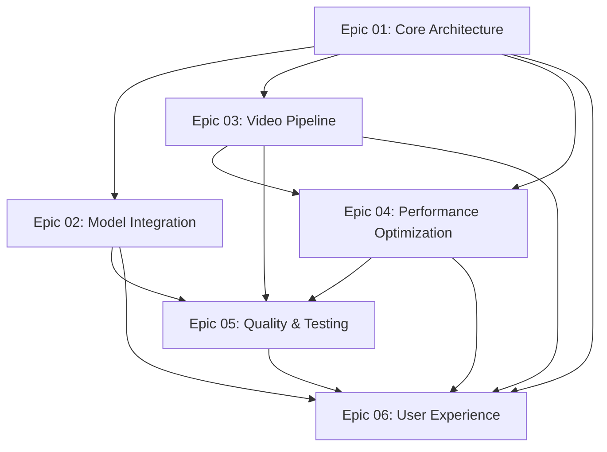

# Video Upscaler Modernization Implementation Plan

## Executive Summary

This implementation plan outlines a comprehensive modernization strategy for the video_upscaler project. The current implementation is a minimal proof-of-concept that uses Real-ESRGAN for frame-by-frame video upscaling. While functional, it lacks many features necessary for production use and doesn't leverage the latest advances in video super-resolution technology.

This plan organizes the modernization effort into **6 epics** containing **26 individual issues** that will transform video_upscaler from an experimental tool into a robust, performant, and user-friendly video upscaling solution.

## Current State vs. Target Architecture

### Current Architecture (v0.1.0)
```
Input Video → PyAV Decode → Frame Loop → RealESRGAN (sberbank-ai) → PyAV Encode → Output (MPEG4)
                                ↓
                          Single Frame Processing
                          No Audio Handling
                          No Temporal Consistency
```

**Limitations:**
- Single model support (outdated Real-ESRGAN fork)
- Frame-by-frame processing with no temporal awareness
- Hardcoded MPEG4 output codec
- No audio stream handling
- No batch processing or parallelization
- Minimal error handling
- No configuration system
- Limited device management

### Target Architecture (v1.0.0)
```
Input Video → Video Processor → Model Router → Multi-Model Support → Frame Processor → Output
     ↓              ↓                ↓              ↓                     ↓              ↓
  Metadata      Audio Track    Model Registry  Real-ESRGAN          Batch GPU       Codec
  Extraction    Preservation   - Real-ESRGAN   EDVR                 Processing      Selection
                               - EDVR          VSR-Transformer       Temporal        Audio Mux
                               - VSR-T         STAR                  Consistency     Quality
                               - STAR                                                Settings
                               - Custom
                                    ↓
                              Config System ← CLI/API Interface
                              Device Manager
                              Cache Layer
```

**Improvements:**
- Multiple SOTA model support with easy extensibility
- Temporal consistency for video-specific processing
- Flexible codec selection and quality control
- Audio and metadata preservation
- Batch processing and GPU optimization
- Comprehensive error handling and logging
- Configuration-driven behavior
- Multi-device support (CUDA, MPS, CPU, multi-GPU)
- Progress tracking and resumption
- Quality metrics and benchmarking

## Epic Overview

### Epic 01: Core Architecture (P0 - Foundation)
Establishes the fundamental abstractions and patterns that all other features will build upon.

**Issues:**
1. Model Abstraction Layer - Create unified interface for SR models
2. Video Processing Pipeline - Refactor video I/O into reusable components
3. Configuration System - Implement flexible config management
4. Device Management - Enhanced multi-device support

**Dependencies:** None (starting point)
**Estimated Effort:** 3-4 weeks
**Success Metrics:**
- All models implement common interface
- Video pipeline supports pluggable components
- Configuration can be loaded from files/CLI/environment
- Automatic device selection and fallback works

### Epic 02: Model Integration (P0 - Core Functionality)
Integrates modern, maintained super-resolution models and creates a registry system.

**Issues:**
1. Real-ESRGAN Upgrade - Migrate to xinntao/Real-ESRGAN with basicsr
2. EDVR Integration - Add temporal-aware video SR
3. VSR-Transformer Integration - Add transformer-based SR
4. STAR Model Integration - Add diffusion-based SOTA model
5. Model Registry - Implement model discovery and selection

**Dependencies:** Epic 01 (Model Abstraction Layer)
**Estimated Effort:** 4-5 weeks
**Success Metrics:**
- 4+ models available through unified interface
- Users can select models via CLI/config
- Model weights auto-download and cache properly
- Performance benchmarks for each model documented

### Epic 03: Video Pipeline Improvements (P1 - Essential Features)
Enhances video processing with audio handling, codec options, and temporal consistency.

**Issues:**
1. Audio Stream Handling - Preserve and sync audio tracks
2. Codec Selection - Support multiple output codecs
3. Temporal Consistency - Implement inter-frame processing
4. Batch Frame Processing - Process multiple frames simultaneously
5. Progress and Resumption - Allow pausing/resuming long jobs

**Dependencies:** Epic 01 (Video Processing Pipeline)
**Estimated Effort:** 3-4 weeks
**Success Metrics:**
- Audio syncs perfectly with upscaled video
- 5+ output codec options available
- Temporal artifacts reduced by 50%+
- Batch processing improves throughput by 30%+
- Jobs can resume from interruption

### Epic 04: Performance Optimization (P1 - Production Ready)
Optimizes performance through parallelization, memory management, and caching.

**Issues:**
1. Multi-GPU Support - Distribute workload across GPUs
2. Memory Optimization - Reduce peak memory usage
3. Parallel Processing - CPU-side parallelization
4. Caching Strategy - Cache intermediate results

**Dependencies:** Epic 01, Epic 03
**Estimated Effort:** 2-3 weeks
**Success Metrics:**
- Multi-GPU achieves near-linear speedup
- Memory usage reduced by 40%+
- Processing speed improved by 50%+
- Cache hit rate > 80% for repeated operations

### Epic 05: Quality and Testing (P0 - Reliability)
Establishes comprehensive testing, quality metrics, and CI/CD.

**Issues:**
1. Comprehensive Test Suite - Unit, integration, and E2E tests
2. Quality Metrics - PSNR, SSIM, VMAF measurement
3. Benchmark Suite - Performance regression testing
4. CI/CD Pipeline - Automated testing and deployment

**Dependencies:** All epics (continuous integration)
**Estimated Effort:** 3-4 weeks
**Success Metrics:**
- Test coverage > 80%
- All PRs run automated tests
- Quality metrics tracked for all models
- Benchmark suite runs nightly

### Epic 06: User Experience (P2 - Usability)
Improves CLI interface, logging, documentation, and example workflows.

**Issues:**
1. CLI Improvements - Rich CLI with better UX
2. Logging and Reporting - Structured logging and reports
3. Documentation - Comprehensive user and developer docs
4. Example Workflows - Common use case examples

**Dependencies:** All epics
**Estimated Effort:** 2-3 weeks
**Success Metrics:**
- CLI has intuitive interface with help
- Logs are structured and searchable
- Documentation covers all features
- 10+ example workflows provided

## Dependency Graph



## Recommended Implementation Order

### Phase 1: Foundation (Weeks 1-4)
**Goal:** Establish core architecture and patterns

1. **Epic 01, Issue 01** - Model Abstraction Layer
2. **Epic 01, Issue 02** - Video Processing Pipeline
3. **Epic 01, Issue 03** - Configuration System
4. **Epic 01, Issue 04** - Device Management

**Deliverable:** Refactored codebase with clean abstractions

### Phase 2: Model Expansion (Weeks 5-9)
**Goal:** Integrate multiple SOTA models

1. **Epic 02, Issue 01** - Real-ESRGAN Upgrade
2. **Epic 02, Issue 05** - Model Registry
3. **Epic 02, Issue 02** - EDVR Integration
4. **Epic 02, Issue 03** - VSR-Transformer Integration

**Deliverable:** Multi-model support with 3+ models available

### Phase 3: Video Enhancement (Weeks 10-13)
**Goal:** Improve video processing capabilities

1. **Epic 03, Issue 01** - Audio Stream Handling
2. **Epic 03, Issue 02** - Codec Selection
3. **Epic 03, Issue 04** - Batch Frame Processing
4. **Epic 03, Issue 03** - Temporal Consistency

**Deliverable:** Production-quality video output with audio

### Phase 4: Performance (Weeks 14-16)
**Goal:** Optimize for speed and resource usage

1. **Epic 04, Issue 02** - Memory Optimization
2. **Epic 04, Issue 03** - Parallel Processing
3. **Epic 04, Issue 01** - Multi-GPU Support
4. **Epic 04, Issue 04** - Caching Strategy

**Deliverable:** 2-3x performance improvement

### Phase 5: Quality Assurance (Weeks 17-20)
**Goal:** Ensure reliability and quality

1. **Epic 05, Issue 01** - Comprehensive Test Suite
2. **Epic 05, Issue 04** - CI/CD Pipeline
3. **Epic 05, Issue 02** - Quality Metrics
4. **Epic 05, Issue 03** - Benchmark Suite

**Deliverable:** Robust testing and quality tracking

### Phase 6: Polish (Weeks 21-23)
**Goal:** Improve user experience

1. **Epic 06, Issue 01** - CLI Improvements
2. **Epic 06, Issue 02** - Logging and Reporting
3. **Epic 06, Issue 03** - Documentation
4. **Epic 06, Issue 04** - Example Workflows

**Deliverable:** User-friendly, well-documented tool

### Phase 7: Advanced Features (Weeks 24+)
**Goal:** Cutting-edge capabilities

1. **Epic 02, Issue 04** - STAR Model Integration
2. **Epic 03, Issue 05** - Progress and Resumption

**Deliverable:** SOTA capabilities and enterprise features

## Success Metrics and KPIs

### Performance Metrics
- **Processing Speed:** 2-3x improvement over baseline
- **Memory Usage:** 40% reduction in peak memory
- **Multi-GPU Scaling:** >80% efficiency with 2 GPUs, >60% with 4 GPUs
- **Batch Processing:** 30%+ throughput improvement

### Quality Metrics
- **PSNR:** >32dB average improvement
- **SSIM:** >0.90 structural similarity
- **VMAF:** >80 perceptual quality score
- **Temporal Consistency:** <5% flicker metric

### Reliability Metrics
- **Test Coverage:** >80% line coverage
- **CI Success Rate:** >95% green builds
- **Crash Rate:** <0.1% of processing jobs
- **Recovery Rate:** 100% of interrupted jobs resumable

### Usability Metrics
- **Time to First Success:** <10 minutes for new users
- **Documentation Coverage:** 100% of public APIs documented
- **Example Coverage:** 10+ common workflows
- **CLI Intuitiveness:** <5 commands for 80% of use cases

## Timeline Estimates

| Phase | Duration | Effort | Target Date |
|-------|----------|--------|-------------|
| Phase 1: Foundation | 4 weeks | 160 hours | Week 4 |
| Phase 2: Model Expansion | 5 weeks | 200 hours | Week 9 |
| Phase 3: Video Enhancement | 4 weeks | 160 hours | Week 13 |
| Phase 4: Performance | 3 weeks | 120 hours | Week 16 |
| Phase 5: Quality Assurance | 4 weeks | 160 hours | Week 20 |
| Phase 6: Polish | 3 weeks | 120 hours | Week 23 |
| Phase 7: Advanced Features | 3+ weeks | 120+ hours | Week 26+ |
| **Total** | **26 weeks** | **1040 hours** | **6 months** |

**Assumptions:**
- 1 full-time developer
- 40 hours per week
- Includes time for research, testing, documentation
- Buffer time for unexpected challenges

## Risk Assessment

### High Risk Items

#### 1. Model Integration Complexity
**Risk:** New models may have incompatible APIs or dependencies
**Mitigation:**
- Prototype each model integration early
- Create compatibility layer in abstraction
- Maintain fallback to working models
**Contingency:** Reduce model count if integration proves too complex

#### 2. Performance Regression
**Risk:** New architecture may be slower than current implementation
**Mitigation:**
- Benchmark continuously during development
- Profile hot paths and optimize early
- Maintain performance test suite
**Contingency:** Implement performance-critical paths in optimized code

#### 3. Memory Management
**Risk:** Processing high-resolution video may exceed available memory
**Mitigation:**
- Implement streaming processing
- Add memory usage monitoring
- Support chunk-based processing
**Contingency:** Add memory limit configuration and automatic downsampling

### Medium Risk Items

#### 4. Audio Synchronization
**Risk:** Audio may desync from video after processing
**Mitigation:**
- Use timestamp-based synchronization
- Test with various framerates and codecs
- Add A/V sync validation
**Contingency:** Provide manual offset adjustment option

#### 5. Codec Compatibility
**Risk:** Some codecs may not work on all platforms
**Mitigation:**
- Test on Windows, Linux, macOS
- Document codec availability by platform
- Provide codec detection and fallback
**Contingency:** Limit to universally supported codecs

### Low Risk Items

#### 6. Configuration Complexity
**Risk:** Too many configuration options may confuse users
**Mitigation:**
- Provide sensible defaults
- Use presets for common scenarios
- Add configuration validation
**Contingency:** Hide advanced options in separate config section

## Research References

### Models and Algorithms
- **Real-ESRGAN:** https://github.com/xinntao/Real-ESRGAN
  - Paper: https://arxiv.org/abs/2107.10833
  - Maintained fork with video support and frequent updates
  
- **BasicSR:** https://github.com/XPixelGroup/BasicSR
  - Foundation library for super-resolution research
  - Includes ESRGAN, EDVR, and many other models
  
- **EDVR:** https://github.com/xinntao/EDVR
  - Paper: https://arxiv.org/abs/1905.02716
  - Multi-frame temporal super-resolution
  
- **VSR-Transformer:** https://github.com/caojiezhang/VSR-Transformer
  - Paper: https://arxiv.org/abs/2106.06847
  - Vision transformer for video SR
  
- **STAR:** https://arxiv.org/abs/2310.10837
  - Spatial-Temporal Augmented Resolution
  - Current SOTA for video super-resolution (2024)

### Libraries and Tools
- **Spandrel:** https://github.com/chaiNNer-org/spandrel
  - Universal model loader for SR architectures
  - Supports automatic architecture detection
  
- **Video2X:** https://github.com/k4yt3x/video2x
  - Reference implementation for video upscaling pipelines
  - Good patterns for progress tracking and resumption
  
- **ffmpeg-python:** https://github.com/kkroening/ffmpeg-python
  - More flexible video processing than PyAV alone
  - Better codec support and options
  
- **Decord:** https://github.com/dmlc/decord
  - Fast video reader optimized for ML workflows
  - Better than OpenCV for batch loading

### Quality Metrics
- **VMAF:** https://github.com/Netflix/vmaf
  - Netflix perceptual video quality metric
  - Industry standard for video quality assessment
  
- **PyTorch Metrics:** https://torchmetrics.readthedocs.io/
  - PSNR, SSIM, and other metrics
  - PyTorch-native implementations

### Benchmarks and Datasets
- **Vid4:** Standard video SR benchmark dataset
- **REDS:** Realistic and Dynamic Scenes dataset
- **Vimeo90K:** Large-scale video dataset for SR
- **UDM10:** User-generated content benchmark

## Version Milestones

### v0.1.0 (Current)
- Basic frame-by-frame upscaling
- Single model (sberbank-ai Real-ESRGAN)
- MPEG4 output only

### v0.5.0 (Phase 1-2 Complete)
- Core architecture refactored
- 3+ model support
- Model registry and selection
- Configuration system

### v0.8.0 (Phase 3-4 Complete)
- Audio preservation
- Multiple codec support
- Batch processing
- Performance optimizations

### v1.0.0 (Phase 5-6 Complete)
- Comprehensive test coverage
- CI/CD pipeline
- Quality metrics
- Documentation complete
- Production ready

### v1.5.0+ (Phase 7+)
- STAR model integration
- Advanced temporal consistency
- Progress resumption
- Multi-GPU optimizations

## Contributing to This Plan

This implementation plan is a living document. As work progresses, update this README and individual issue files to reflect:
- Completed work
- New insights or approaches
- Changed priorities
- Additional requirements

Each issue file should be updated with:
- Implementation notes
- Actual vs. estimated effort
- Lessons learned
- Links to PRs and commits

## Getting Started

1. Review this README and the dependency graph
2. Start with Epic 01, Issue 01 (Model Abstraction Layer)
3. Read the acceptance criteria and technical details for each issue
4. Create a GitHub issue from each markdown file
5. Link issues according to dependencies
6. Begin implementation following the recommended order

## Questions and Feedback

For questions about this implementation plan, please:
1. Open a discussion in GitHub Discussions
2. Tag issues with `question` or `planning`
3. Update this document based on team feedback

---

**Last Updated:** 2025-12-27
**Version:** 1.0
**Status:** Active Development
